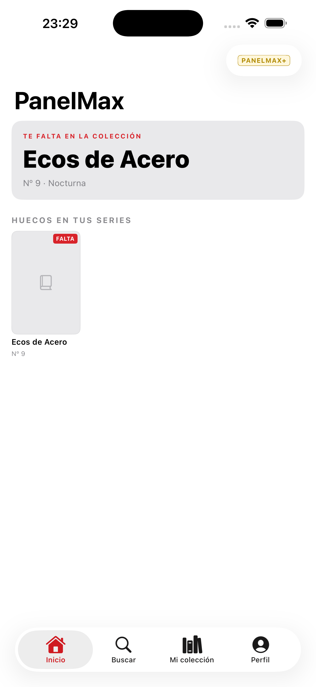
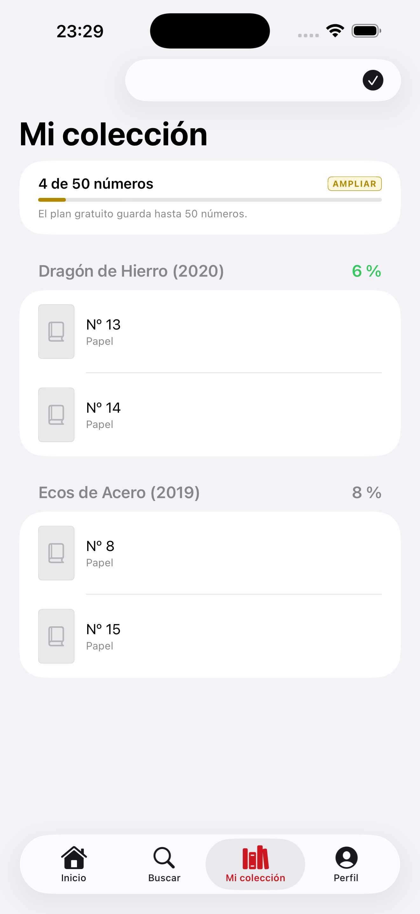
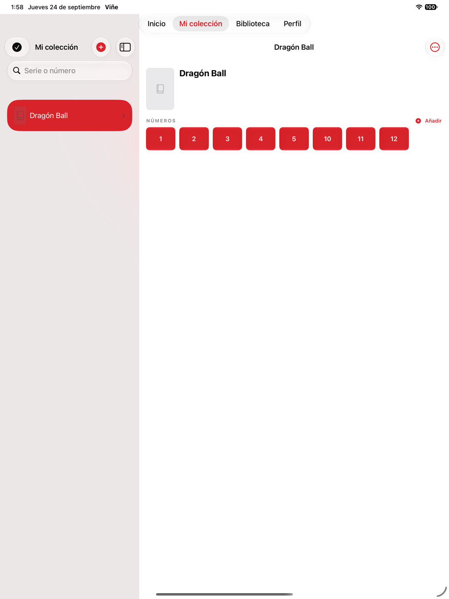
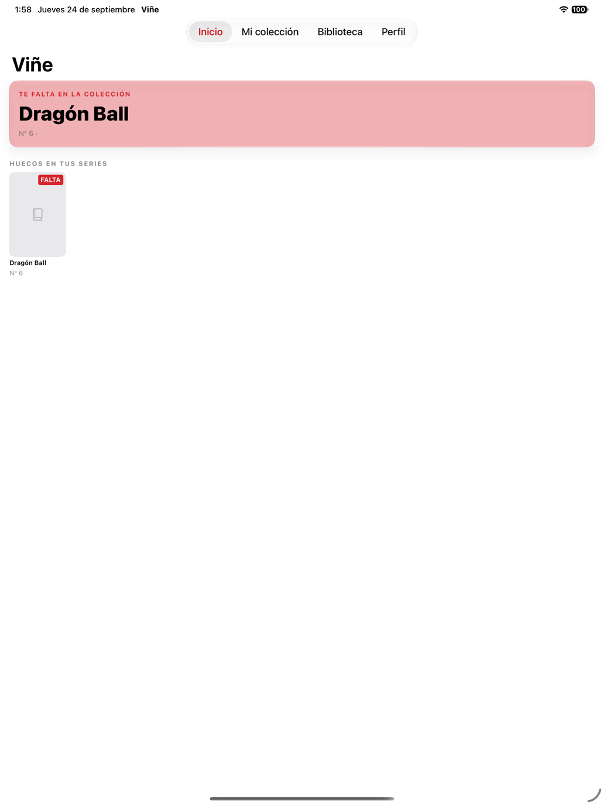

# Viñe 📚

*(nombre de proyecto interno en Xcode: PanelMax — ver nota en Arquitectura)*

Aplicación iOS para catalogar una colección de cómics a mano y leer archivos
propios en CBZ y PDF. Funciona por completo sin conexión: sin catálogo
remoto, sin cuenta y sin compras.

## Funciones · versión 1.0

- Catalogar series a mano: título, editorial, año y números publicados en
  total, para calcular huecos y porcentaje de la colección.
- Añadir números uno a uno o por rango completo ("del 1 al 40" de una vez).
- Marcar cada número como poseído, deseado o leído, en papel o en digital.
- Importar, listar, abrir, vincular y eliminar archivos CBZ y PDF propios.
- Leer con progreso, caché, reducción de imágenes grandes, zoom persistente
  por pellizco o doble toque, arrastre dentro de la página, y un deslizador
  para saltar directamente a una página.
- En iPad, lectura en doble página cuando el ancho disponible lo permite
  (respeta Split View y Stage Manager), con la portada siempre sola y la
  posición de lectura conservada al rotar el dispositivo.
- Portada automática por cómic, generada desde su propia primera página: no
  hace falta catálogo remoto para tener miniaturas.
- Un cómic de bienvenida incluido, para que la biblioteca no empiece vacía.
- Exportar la colección catalogada a un archivo, como única copia de
  seguridad posible sin iCloud ni cuenta.
- Accesibilidad: tipografías escalables con Dynamic Type, filas y controles
  descritos para VoiceOver, y elementos decorativos (portadas, chevrons)
  ocultos al lector de pantalla para no generar ruido.
- Disfrutar de superficies Liquid Glass en iOS 26 en Inicio, la ficha de
  serie y el lector, con una apariencia equivalente y compatible en iOS 18–25.

## Capturas

  
  &nbsp;&nbsp;
  
  &nbsp;&nbsp;
  
  &nbsp;&nbsp;
  

  <strong>Inicio (iPhone)</strong>&nbsp;&nbsp;&nbsp;&nbsp;&nbsp;&nbsp;
  <strong>Mi colección (iPhone)</strong>&nbsp;&nbsp;&nbsp;&nbsp;&nbsp;&nbsp;
  <strong>Mi colección (iPad)</strong>&nbsp;&nbsp;&nbsp;&nbsp;&nbsp;&nbsp;
  <strong>Inicio (iPad)</strong>

Viñe no distribuye cómics. Los archivos de lectura son seleccionados por
el usuario y se copian al contenedor privado de la app.

No están implementados en esta versión el catálogo remoto, la suscripción,
la sincronización con iCloud, la vista guiada viñeta a viñeta, el escáner de
códigos ni el uso compartido en familia. Volverán en versiones futuras
cuando haya un servicio real detrás que los justifique.

## Arquitectura

> **Sobre el nombre**: la app se presenta a los usuarios como **Viñe**, pero
> el proyecto de Xcode, la carpeta del repositorio, el esquema, los tipos y
> los comentarios del código siguen usando `PanelMax`. Es intencional: cambiar
> el nombre visible no exige renombrar el proyecto entero, y hacerlo habría
> significado tocar cientos de referencias sin necesidad real. Si en algún
> momento se decide rebautizar también el proyecto interno, es un cambio
> aparte, cosmético, que no depende de nada de lo descrito aquí.

| Área | Implementación |
|---|---|
| Interfaz | SwiftUI, `NavigationStack` y estado Observable |
| Persistencia | SwiftData local; sin CloudKit |
| Portadas | Generadas en el dispositivo desde la página 1 del propio archivo |
| Lector | PDFKit, ImageIO y ZIPFoundation 0.9.20 |
| Pruebas | Swift Testing, sin dependencias externas ni acceso a red |
| Concurrencia | Modo de lenguaje Swift 6, aislamiento `MainActor` por defecto |

`CollectionStore` centraliza todas las escrituras sobre la colección
(crear series, añadir números por rango, cambiar estados, vincular
archivos). Ninguna vista toca `ModelContext` directamente.

Si el almacén persistente no puede abrirse, la app no borra la colección:
arranca con un contenedor temporal y muestra el problema.

El esquema está versionado desde la versión 1 en `PanelMaxSchema.swift`, con
un `SchemaMigrationPlan` ya conectado al contenedor. Cuando cambie un modelo
hay que añadir una `V2` y su etapa de migración; el esquema activo se declara
en un único sitio (`Schema.panelMax`) que comparten la app, las
previsualizaciones y los tests.

Los cómics importados viven en `Documents/Comics` y sus miniaturas en
`Documents/Covers`, ambas excluidas de la copia de seguridad de iCloud: son
archivos grandes (o regenerables) que no deben consumir la cuota de respaldo
del usuario.

## Requisitos y ejecución

- Xcode 26.6 o posterior (toolchain de Swift 6.4).
- iOS 18 o posterior. iPhone y iPad.

El proyecto compila en **modo de lenguaje Swift 6**: la concurrencia estricta
se comprueba en tiempo de compilación, no como avisos.

1. Clona el repositorio y abre `PanelMax.xcodeproj`.
2. Xcode resolverá automáticamente ZIPFoundation, fijado exactamente en la
   versión 0.9.20.
3. Ejecuta el esquema compartido `PanelMax`. Al primer arranque se importa un
   cómic de ejemplo para que la biblioteca no empiece vacía.
4. Usa `⌘U` para ejecutar los tests.

## Pruebas y CI

La suite incluye pruebas para:

- orden natural de números y especiales, con casos límite (cero, negativos, empates);
- alta de series y números, incluida el alta por rango y sus casos límite;
- huecos de una serie, porcentaje de progreso y estados de colección;
- que borrar una serie no borra el archivo importado que tenía vinculado;
- progreso de lectura del archivo importado y escrituras SwiftData;
- validación de rutas de archivo frente a nombres manipulados (`../`, separadores).

GitHub Actions (`.github/workflows/ci.yml`) ejecuta `PanelMaxTests` en un
simulador y compila además la configuración Release. Ninguna prueba necesita
red ni credenciales, porque la app tampoco las usa.

## Registro de cambios

### En desarrollo — 26 de septiembre de 2026

**Añadido**

- Importación de cómics más tolerante: si en un lote hay un archivo no
  compatible (formato no soportado, corrupto o que supera el tamaño máximo
  por archivo), ya no se cancela la importación entera. `ComicImportBatch`
  omite ese archivo y sigue con el resto; al terminar se avisa de cuáles se
  omitieron y por qué. Los límites que sí son del lote completo (más de
  4 GB en total, o espacio en disco insuficiente) siguen abortando toda la
  importación, porque ahí no hay un archivo culpable que aislar.

**Corregido**

- Lector a pantalla completa inconsistente: al abrir un cómic desde Inicio,
  Mi colección o Biblioteca, `ReaderView` se presentaba con `NavigationLink`
  dentro del `NavigationStack` de la pestaña, lo que podía dejar la barra de
  pestañas de fondo asomando. Solo la ficha de serie lo hacía ya bien, con
  `fullScreenCover`. Ahora las cuatro entradas al lector usan
  `fullScreenCover`, consistente en toda la app.

### En desarrollo — 25 de septiembre de 2026

**Cambiado**

- Los tres enlaces legales de Perfil (Condiciones, Privacidad y Soporte)
  apuntaban a GitHub (y Condiciones a la EULA estándar de Apple). Ahora
  apuntan a la web propia: `vine.kontroldesignstudio.com/condiciones`,
  `/privacidad` y `/soporte`. Siguen abriéndose en el navegador del
  sistema, no dentro de la app: la 1.0 sigue sin hacer peticiones de red
  propias.

### Beta 5 — 24 de septiembre de 2026 (24/09/2026)

**Añadido**

- `NavigationSplitView` en "Mi colección" para iPad en ventana ancha: la
  barra lateral lista solo las series (título y % de completado) y el
  panel de detalle muestra su ficha completa al seleccionarlas. En iPhone
  y iPad en ventana estrecha se mantiene el diseño de una sola columna,
  sin cambios.
- Capturas de pantalla actualizadas a la versión 1.0 (iPhone e iPad).

**Errores corregidos**

- Teclado numérico en iPad: al añadir un rango de números en "Añadir
  números", `.numberPad` se mostraba como un teclado flotante compacto que
  tapaba el propio campo. Ahora usa un teclado de ancho completo.
- Últimas menciones al nombre antiguo "PanelMax" en contenido visible
  (README y el cómic de bienvenida incluido en la app) corregidas a
  "Viñe".

### Beta — 11 de septiembre de 2026 (11/09/2026)

**Errores corregidos**

- **Lector horizontal en iPhone:** el modo de doble página queda reservado
  al iPad. En un iPhone girado se mantiene una sola página ajustada a la
  pantalla y el zoom por pellizco funciona con normalidad.
- **Portada automática al vincular un cómic:** si la serie no tiene una
  portada elegida manualmente, al vincular un archivo importado a uno de sus
  números se usa una copia de la miniatura generada desde la primera página
  del cómic como portada de la serie. Así la colección deja de dar la
  impresión de mostrar dos cómics distintos.
- **Imágenes de la Fototeca dentro de sus márgenes:** las portadas elegidas
  desde el carrete tienen ahora un marco de proporción fija y se recortan
  dentro de él, incluso cuando la imagen es panorámica o presenta unas
  proporciones poco habituales, sin invadir botones ni otros elementos.

### En desarrollo — 7 de septiembre de 2026

Trabajo de la sesión de hoy, pendiente de subir a App Store junto a una
próxima versión.

**Añadido**

- Portada de colección: al crear o editar una serie se puede elegir una
  imagen de portada desde la Fototeca, guardada localmente en
  `Documents/Covers` igual que las miniaturas de cómics — sin red ni
  catálogo remoto. Cubre los casos límite de cancelar el formulario tras
  elegir imagen, reemplazar la portada más de una vez antes de guardar,
  un guardado fallido y el borrado de la serie.

**Explorado y revertido**

- Sincronización con iCloud (SwiftData + CloudKit privado, sin servidor
  propio, tras un interruptor apagado por defecto). Decisión: la versión
  1.0 se queda completamente local; sincronización y suscripción se
  retoman en la 2.0.

**Rendimiento**

- Peso de portadas calculado por bytes decodificados en vez de por
  cantidad de archivos.
- Posición del pliego en el lector de iPad: de recorrer el array entero a
  una fórmula directa (`O(n) → O(1)`), y el pliego se memoiza en vez de
  reconstruirse en cada render.
- Alta de números por rango: de `O(n²)` a `O(n)` con un índice. Con un
  alta de hasta 2.000 números de golpe, sin el índice suponía cerca de
  dos millones de comparaciones en vez de dos mil.
- Ficha de serie: `progressLine` pasó de tres pasadas de filtrado a dos, y
  `numbersGrid` de un orden duplicado a uno.
- Biblioteca importada: filtrado duplicado de `visibleFiles` reducido a
  una sola pasada.

**Arquitectura**

- Modularización pragmática: sin ViewModels ni protocolos de repositorio,
  SwiftData sigue siendo la capa de persistencia directa tal y como
  estaba. Cambia dónde vive cada cosa: `Domain/` para las reglas de
  negocio, `Infrastructure/` para la E/S de bajo nivel, separadas de
  `Features/`.
- `CollectionStore`, `CollectionExporter` y `ComicNumber` movidos a
  `Domain/` (antes en `Support/`).
- `Domain/CollectionSnapshot` centraliza las métricas que usan todas las
  vistas; `HomeSnapshot` era `private` y no se podía probar de forma
  aislada.
- Nuevo `Domain/LibraryStore.swift`: saca de la vista la importación y el
  borrado con papelera reversible.
- Nuevo `Infrastructure/`: `ThumbnailGenerator`, `ComicImportBatch` y
  `PendingComicDeletion`.
- Siete vistas unificadas a una única forma de pedir `CollectionStore`;
  antes había 11 instancias sueltas.
- `ImportedLibraryView.swift`: 580 → 229 líneas. Contenía, además de la
  vista, toda la lógica de copia atómica y borrado reversible, que no era
  alcanzable por ningún test. Se añadieron 4 tests nuevos para
  `HomeSnapshot` como muestra de lo que ahora se puede probar.

Balance de la sesión: 6 archivos nuevos, 4 movidos, 13 editados, 61 tests
en verde.

### 1.0 — 30 de agosto de 2026

Reescritura para publicar sin depender de infraestructura externa. Sin
cambios en los datos que ya hubiera de la 1.1.0 de desarrollo: quien viniera
de esa build conserva su colección.

**Quitado**

- Catálogo remoto (Metron) y todo lo que dependía de él: búsqueda de series,
  portadas descargadas, próximos lanzamientos.
- Suscripción PanelMax+, muro de pago y límites del plan gratuito. El código
  se conserva aparte, en `Parked/`, para retomarlo cuando haya un catálogo
  real que justifique un cobro recurrente ante Guideline 3.1.2 de Apple.

**Añadido**

- Alta manual de series y números, incluido el alta por rango.
- Portada automática por cómic, generada desde su propia página 1.
- Pestaña propia de Biblioteca, con importar y buscar.
- Deslizador para saltar de página en el lector.
- Lector en doble página para iPad (`SpreadLayout`): portada sola, el resto
  emparejado a partir del segundo número, decidido por el ancho real de la
  ventana para respetar Split View y Stage Manager. La posición de lectura
  se conserva al rotar el dispositivo.
- Exportar la colección a un archivo.
- Un cómic de bienvenida incluido en el primer arranque.
- Flujo para vincular un archivo importado a un número catalogado.
- Pasada de accesibilidad: seis tamaños de fuente fijos sustituidos por
  estilos escalables, `@ScaledMetric` en anchos de tarjetas y columnas del
  grid de números, y etiquetas/valores de VoiceOver en filas de colección,
  biblioteca importada y mandos del lector.
- Nombre visible de la app cambiado a **Viñe** (`INFOPLIST_KEY_CFBundleDisplayName`)
  y Bundle Identifier a `com.kontroldesignstudio.vine`. El proyecto de Xcode
  y sus carpetas conservan el nombre interno `PanelMax`.
- Icono de app nuevo: estallido blanco con una V roja sobre fondo rojo de marca.

**Corregido**

- El enlace de soporte apuntaba a un repositorio que no existía y devolvía 404.
- El badge de CI apuntaba a un flujo de GitHub Actions inexistente.
- La app declaraba región de desarrollo en inglés con toda la interfaz en
  español.
- El ancho de rasterizado de los PDF estaba fijado al ancho de un iPhone;
  en iPad las páginas se veían borrosas por el reescalado. Ahora se calcula
  a partir de la pantalla real (`PDFArchive.preferredRenderWidth()`).
- Al mover el código de compras a `Parked/`, quedó una llamada a un
  coordinador de importación (`ComicImportCoordinator`) sin su definición;
  se restauró en `ImportedLibraryView.swift`.
- Dos propiedades estáticas de `ThumbnailGenerator` (`maxDimension`,
  `compressionQuality`) se leían desde una función `nonisolated` sin estar
  marcadas como tales; con el aislamiento de actor por defecto del proyecto
  (`SWIFT_DEFAULT_ACTOR_ISOLATION = MainActor`), Swift 6 lo rechaza en
  compilación. Mismo tipo de fallo que el de `PDFArchive` de más arriba.
- `INFOPLIST_KEY_CFBundleDisplayName = Viñe;` sin comillas rompía el parseo
  del `.pbxproj` («project is damaged»): el formato antiguo de Xcode no
  admite caracteres no ASCII en un valor sin comillas.

### 1.1.0 — 26 de agosto de 2026 (desarrollo, no publicada)

Build de desarrollo con catálogo remoto y suscripción, nunca enviada a App
Store Connect. Su historial de cambios queda documentado en el control de
versiones para quien retome ese trabajo en una versión futura.

## Antes de App Store

- [x] Accesibilidad: Dynamic Type y VoiceOver en las pantallas principales.
- [x] `NavigationSplitView` en Mi colección para iPad en ventana ancha.
- [x] Sustituir las capturas por otras de la versión 1.0 (sin catálogo).
- [ ] Capturas de iPad de 13" para App Store Connect: obligatorias en cuanto
  el dispositivo está activado, no opcionales (hay candidatas en
  `docs/screenshots/ipad-*.png`, pendiente subirlas a App Store Connect).
- [ ] Comprobar desde un dispositivo real los tres enlaces legales de Perfil,
  ya en `vine.kontroldesignstudio.com`.
- [ ] Poner la URL de privacidad (`vine.kontroldesignstudio.com/privacidad`)
  en el campo "Privacy Policy URL" de App Store Connect.
- [ ] Completar pruebas en dispositivo y localización.
- [ ] Ampliar los UI Tests más allá del mínimo actual.
- [ ] Responder el cuestionario de clasificación por edad en App Store Connect.
- [ ] Declarar no-trader en la Digital Services Act (sin compras integradas).
- [ ] Confirmar que el Bundle Identifier (`com.kontroldesignstudio.vine`)
  encaja con el tipo de cuenta de Apple Developer usada para publicar.

Documentos incluidos: [Privacidad](docs/PRIVACY.md), [Soporte](docs/SUPPORT.md)
y [Términos](docs/TERMS.md).

## Autor

Raúl Gallego — [@kontroldev](https://github.com/kontroldev)

© Raúl Gallego. Todos los derechos reservados. Código visible con fines de
portfolio; no se concede licencia de uso ni redistribución.
