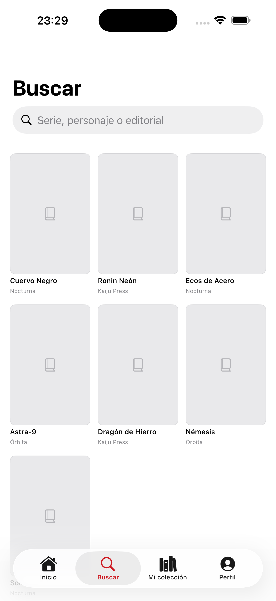
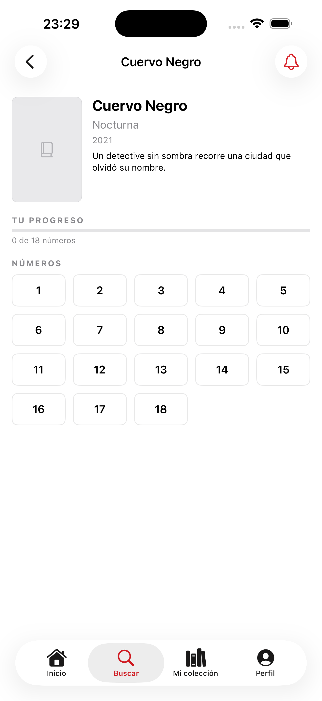
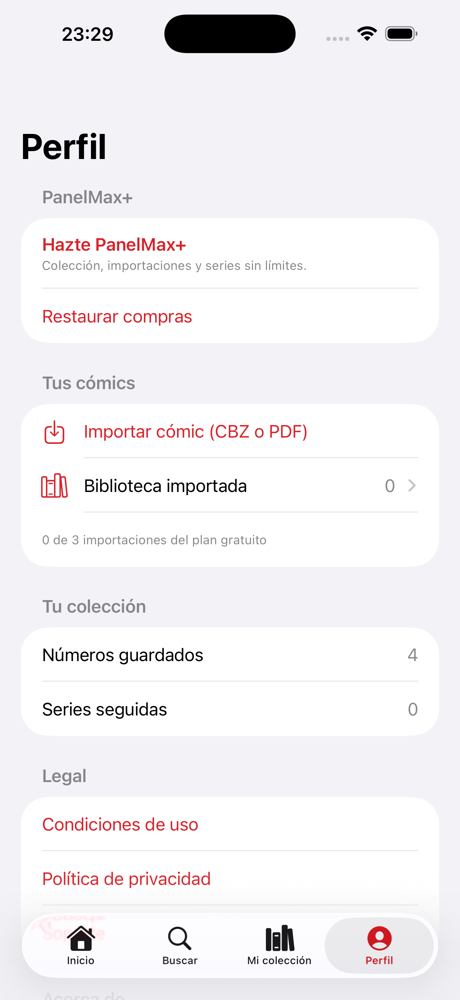

# PanelMax 📚

Aplicación iOS para organizar una colección de cómics y leer archivos CBZ y PDF propios.

> **Estado: en desarrollo.** El proyecto compila como prototipo funcional, pero todavía necesita un backend de catálogo autorizado, configurar los productos reales y completar la validación de App Store antes de distribuirse.

[](https://github.com/kontroldev/PanelMax-App/actions/workflows/ci.yml)


## Funciones actuales · versión 1.1.0

- Buscar series y consultar todos sus números mediante una fuente de catálogo intercambiable.
- Guardar números, seguir series, ver sus próximos lanzamientos y detectar huecos dentro de una colección local.
- Importar, listar, abrir, vincular y eliminar archivos propios.
- Leer PDF y CBZ con progreso, caché, reducción de imágenes grandes, zoom
  persistente por pellizco o doble toque, y arrastre dentro de la página.
- Disfrutar de superficies Liquid Glass en iOS 26 en Inicio, la ficha de serie,
  el lector y el muro de pago, con una apariencia equivalente y compatible en
  iOS 18–25.
- Aplicar límites gratuitos desde una única capa de reglas.
- Probar compras con StoreKit 2 y la configuración local incluida.

## Capturas

<p align="center">
  
  &nbsp;&nbsp;
  
</p>

<p align="center">
  <strong>Inicio</strong>&nbsp;&nbsp;&nbsp;&nbsp;&nbsp;&nbsp;&nbsp;&nbsp;&nbsp;&nbsp;&nbsp;&nbsp;&nbsp;&nbsp;&nbsp;&nbsp;&nbsp;&nbsp;&nbsp;&nbsp;
  <strong>Buscar</strong>
</p>

<p align="center">
  
  &nbsp;&nbsp;
  
</p>

<p align="center">
  <strong>Ficha de serie</strong>&nbsp;&nbsp;&nbsp;&nbsp;&nbsp;&nbsp;&nbsp;&nbsp;&nbsp;&nbsp;&nbsp;&nbsp;
  <strong>Mi colección</strong>
</p>

<p align="center">
  
</p>

<p align="center">
  <strong>Perfil</strong>
</p>

<p align="center">
  <sub>Capturas tomadas en Debug con el catálogo ficticio de desarrollo: por eso las portadas aparecen como marcadores de posición.</sub>
</p>

PanelMax no distribuye cómics. Los archivos de lectura son seleccionados por el usuario y se copian al contenedor privado de la app.

No están implementados en esta versión la sincronización con iCloud, la vista guiada viñeta a viñeta, el escáner de códigos, las notificaciones de novedades ni el uso compartido en familia. No deben anunciarse como ventajas de pago hasta que existan y estén probados.

## Arquitectura

| Área | Implementación |
|---|---|
| Interfaz | SwiftUI, `NavigationStack` y estado Observable |
| Persistencia | SwiftData local; sin CloudKit |
| Catálogo | `CatalogSource`, fuente ficticia para desarrollo y cliente remoto paginado |
| Lector | PDFKit, ImageIO y ZIPFoundation 0.9.20 |
| Compras | StoreKit 2 y `PanelMax.storekit` para pruebas locales |
| Pruebas | Swift Testing y stubs de red sin acceder a servicios reales |
| Concurrencia | Modo de lenguaje Swift 6, aislamiento `MainActor` por defecto |

Las vistas reciben el catálogo mediante el entorno. Los resultados remotos son DTO temporales y solo se convierten en modelos SwiftData cuando el usuario guarda contenido. `CollectionStore` centraliza las escrituras y `PremiumGate` centraliza los límites.

Si el almacén persistente no puede abrirse, la app no borra la colección: arranca con un contenedor temporal y muestra el problema.

El esquema está versionado desde la versión 1 en `PanelMaxSchema.swift`, con un
`SchemaMigrationPlan` ya conectado al contenedor. Cuando cambie un modelo hay que
añadir una `V2` y su etapa de migración; el esquema activo se declara en un único
sitio (`Schema.panelMax`) que comparten la app, las previsualizaciones y los tests.

Los cómics importados viven en `Documents/Comics`, que se marca como excluida de
la copia de seguridad de iCloud: son archivos grandes que el usuario ya tiene en
su dispositivo y que no deben consumir su cuota de respaldo.

## Requisitos y ejecución

- Xcode 26.6 o posterior (toolchain de Swift 6.4).
- iOS 18 o posterior.

El proyecto compila en **modo de lenguaje Swift 6**: la concurrencia estricta se
comprueba en tiempo de compilación, no como avisos. Los tipos que cruzan hilos
(`CBZArchive`, `PDFArchive`) declaran su aislamiento de forma explícita y
protegen su estado mutable con colas en serie.

1. Clona el repositorio y abre `PanelMax.xcodeproj`.
2. Xcode resolverá automáticamente ZIPFoundation, fijado exactamente en la versión 0.9.20.
3. Ejecuta el esquema compartido `PanelMax`. En Debug se usa un catálogo ficticio sin conexión.
4. Usa `⌘U` para ejecutar los tests.

El esquema compartido carga `StoreKit/PanelMax.storekit` durante Run, por lo que las compras locales no requieren modificar el esquema personal de Xcode. El archivo queda fuera del target de la app y no se incorpora al paquete de distribución.

## Configuración segura del catálogo

Una app instalada no puede guardar de forma secreta un usuario, contraseña o token: cualquier valor incluido en el binario o en su Info.plist puede extraerse. Por eso Release solo acepta la URL HTTPS de un proxy propio mediante el build setting:

```text
PANELMAX_CATALOG_BASE_URL = https://catalogo.example.com/api/
```

El proxy debe custodiar la credencial del proveedor, limitar peticiones, cachear respuestas y exponer respuestas compatibles con los endpoints `series/` e `issue/` de Metron. También debe reescribir los enlaces absolutos de paginación (`next`) para que conserven el mismo origen y la ruta base del proxy; el cliente rechaza enlaces de paginación hacia otros servidores por seguridad. Si la URL no está configurada, la app muestra un error explícito y no sustituye el catálogo por datos ficticios en producción.

Para probar Metron directamente **solo en desarrollo**, añade estas variables al Run Scheme sin marcarlas como compartidas:

```text
PANELMAX_USE_LIVE_CATALOG = 1
METRON_API_TOKEN = <token local>
```

También se admite `METRON_USER` junto con `METRON_PASSWORD` para una cuenta local. Esas credenciales solo se leen en Debug y nunca desde Info.plist.

Antes de distribuir una build que use Metron, solicita y conserva permiso escrito para el uso previsto, respeta sus límites y verifica los requisitos de atribución. Este repositorio no presupone que exista autorización comercial.

## Compras

La configuración StoreKit local contiene acceso de pago único y productos renovables para probar escenarios. El código limita los derechos a los identificadores conocidos, verifica transacciones y evita crear listeners duplicados.

Las suscripciones renovables permanecen desactivadas en builds normales. Solo pueden exponerse configurando `ENABLE_RECURRING_SUBSCRIPTIONS = YES` después de disponer de productos aprobados en App Store Connect, beneficios reales y soporte operativo. Hasta entonces, las pruebas locales no equivalen a productos publicados.

## Pruebas y CI

La suite incluye pruebas para:

- orden natural de números y especiales, con casos límite (cero, negativos, empates);
- huecos de una serie, porcentaje de progreso y estados de colección;
- fronteras de los límites gratuitos;
- progreso de lectura del archivo importado y escrituras SwiftData;
- validación de rutas de archivo frente a nombres manipulados (`../`, separadores);
- contrato del catálogo ficticio;
- paginación, autenticación, filtrado y seguridad de enlaces del cliente remoto.

GitHub Actions (`.github/workflows/ci.yml`) ejecuta `PanelMaxTests` en un
simulador y compila además la configuración Release, que usa una ruta de
configuración del catálogo distinta de la de Debug. Las pruebas de red usan
`URLProtocol`, por lo que no consumen cuota ni necesitan credenciales.

## Registro de cambios

### 1.1.0 — 26 de agosto de 2026

Actualización visual compatible con iOS 18 y adaptada al nuevo lenguaje de
diseño de iOS 26. No cambia el modelo de datos ni requiere migrar la colección.

**Añadido**

- Componente reutilizable `panelGlass` que aplica Liquid Glass nativo en iOS 26
  y conserva un fallback opaco con borde en iOS 18–25.
- Superficies de cristal en la tarjeta principal de Inicio, los controles del
  lector, los números de la ficha de serie, los planes y el botón de compra.
- Interactividad de cristal en los controles que responden al toque.

**Cambiado**

- Radio de tarjeta centralizado en el sistema de diseño para mantener una
  geometría coherente entre pantallas.
- Pequeñas correcciones de Swift 6 en el arranque y en dos pruebas asíncronas,
  eliminando resultados ignorados y `try` innecesarios.

**Corregido**

- La configuración StoreKit del esquema vuelve a usar una ruta relativa
  portable, válida al clonar el repositorio en cualquier carpeta.
- El estado personal de Xcode (`xcuserdata`) queda excluido del control de
  versiones.

### 1.0.1 — 22 de agosto de 2026

Auditoría completa del proyecto y corrección de los problemas encontrados. Sin
cambios en el modelo de datos: las colecciones existentes se conservan.

**Corregido**

- Los enlaces de privacidad y soporte del muro de pago apuntaban a un
  repositorio que no existe y devolvían 404. Un revisor de App Store los abre.
- En la ficha de serie, el estado «lo quiero» era inalcanzable desde la interfaz
  y, si llegaba a existir, tocar el número lo **borraba** de la colección en vez
  de marcarlo como poseído.
- «Continuar leyendo» se calculaba sobre el progreso del número de catálogo, así
  que un CBZ importado sin vincular nunca aparecía aunque el lector sí guardara
  su posición. Ahora hay una única fuente de progreso.
- Un marcador de archivo que iOS daba por obsoleto lanzaba un error y dejaba el
  cómic inaccesible de forma permanente. Ahora se regenera dentro del alcance de
  seguridad.
- Las portadas se borraban en cada aparición de la vista y toda la rejilla
  parpadeaba al volver atrás por el `NavigationStack`.
- El número de páginas del catálogo se esperaba como `page_count` cuando Metron
  lo devuelve como `page`: se decodificaba siempre a cero, en silencio.
- El zoom del lector volvía a su posición original al soltar los dedos, lo que
  hacía imposible detenerse en una viñeta.

**Añadido**

- Menú contextual en la rejilla de números con los tres estados (lo tengo, lo
  quiero, leído) y los dos formatos (papel, digital), que el modelo ya soportaba
  pero ninguna vista podía producir.
- Arrastre con límites y doble toque en el lector, además del zoom persistente.
- Esquema versionado (`PanelMaxSchema.swift`) con `SchemaMigrationPlan`
  conectado al contenedor desde la versión 1.
- `Documents/Comics` se marca como excluida de la copia de seguridad de iCloud.
  Una biblioteca de cómics importados puede ocupar varios GB del respaldo del
  usuario, y es una causa habitual de rechazo.
- Caché en memoria de próximos lanzamientos, por serie y con caducidad de 30
  minutos. Seguir diez series agotaba el límite de peticiones del catálogo en dos
  visitas a Inicio.
- Flujo de integración continua (`.github/workflows/ci.yml`) que ejecuta los
  tests y compila también en Release, que usa una ruta de configuración distinta.
- 32 pruebas nuevas: huecos y porcentaje de una serie, estados de colección,
  especiales, progreso del archivo importado y validación de rutas frente a
  nombres manipulados.

**Cambiado**

- El proyecto pasa al **modo de lenguaje Swift 6** (antes compilaba en modo 5).
  La concurrencia estricta deja de ser un aviso silenciado y se comprueba en
  compilación. El cambio destapó tres problemas reales de aislamiento que ya
  están corregidos.
- Inicio y Mi colección calculan sus secciones en una única pasada sobre los
  datos. Antes, cada propiedad derivada se reevaluaba en cada sitio donde se
  usaba, recorriendo la colección entera varias veces por render.
- La ficha de serie consulta con un predicado en lugar de traer todas las series
  guardadas para filtrar en memoria.
- Los recuentos de la colección salen del cuerpo de las vistas, donde se
  ejecutaban en cada evaluación.

**Conocido**

- `MetronCatalogTests.followsPagination` está desactivado. Pasa siempre en
  solitario y falla de forma intermitente junto al resto de la suite. Se descartó
  la contaminación entre pruebas aislando cada test con su propia sesión y token;
  la causa real sigue sin identificarse. Solo afecta al stub de red, no a código
  de producción.

### 1.0 — 21 de agosto de 2026

Primera versión publicada del código. Búsqueda de series, colección local con
detección de huecos, importación y lectura de CBZ y PDF, límites del plan
gratuito y compras con StoreKit 2.

## Antes de App Store

- [ ] Desplegar el backend de catálogo y documentar su tratamiento de datos.
- [ ] Obtener permiso del proveedor y probar rate limits, caché y errores reales.
- [ ] Crear y validar los productos en App Store Connect.
- [ ] Probar compras, restauraciones, reembolsos y revocaciones en Sandbox.
- [ ] Publicar `docs/` en la rama `main` y comprobar desde un dispositivo todos los enlaces legales.
- [ ] Añadir un plan de migración cuando cambie el esquema persistente.
- [ ] Completar pruebas en dispositivo, accesibilidad, localización y metadatos.
- [ ] Revisar la ficha de privacidad y los documentos legales contra la build final.

Documentos incluidos: [Privacidad](docs/PRIVACY.md), [Soporte](docs/SUPPORT.md) y [Términos](docs/TERMS.md).

## Autor

Raúl Gallego — [@kontroldev](https://github.com/kontroldev)

© Raúl Gallego. Todos los derechos reservados. Código visible con fines de portfolio; no se concede licencia de uso ni redistribución.
